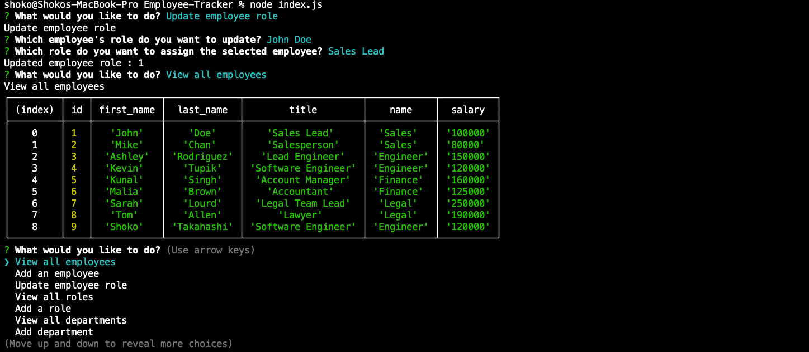

# Employee-Tracker
## Description
To build a command-line application from scratch to manage a company's employee database, using Node.js, Inquirer, and MySQL.

## Table of Contents
* [Installation](#installation)
* [Usage](#usage)
* [Link](#link)
* [License](#license)

## Installation
Mysql and Inquirer, dontev

## Usage
1.View all employees and roles,departments

2.Added an employee

3.Added a role

4.Added a department

5.Updated an employee role

## Link
[Github repository](https://github.com/Shok1to/Note-Taker)

[Employee tracker video demo](https://drive.google.com/file/d/19ZzsULObB6_Xu2BvuyIwIo8zRsbLjMXR/view)

## License

